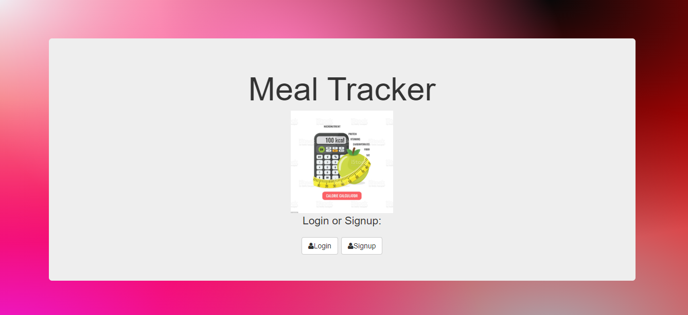

# My Calorie Deficit Project
This appliation acts as a diet tracker. Enabling users to hold themselves accountable to what they eat on a day to day. Not only does this platform store this information as to track progress but you can also interact with others on the same journey with you as they also add their favorite meals maintaining a calorie deficit

## How It's Made:

**Tech used:** HTML, CSS, JavaScript, Node.js, MongoDb

I utilized my skills in javaScript, HTML and CSS to capture an inviting application for users. I also utilized Mongo.Db and Node.js to serve up information to a user after they send a request to my server. I am able to view and manipulate(delete) users information as they provide it.

## Lessons Learned:
I learned to manipulate a put method by applying javaScript in HTML using a ejs file. Where I was then able to manipulate color of text, at the users click.